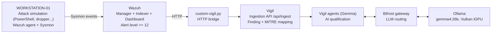

# Sovereign Agentic SOC

A fully self-hosted, sovereign agentic SOC: detection by Wazuh, alert qualification by a local
LLM (Ollama), orchestration by Vigil. No data leaves the infrastructure.

**Status:** the full chain works end to end (attack -> detection -> bridge -> sovereign AI
qualification). Autonomous multi-agent orchestration is not yet finalized; see
[Results and status](#5-results-and-status) and [docs/troubleshooting.md](docs/troubleshooting.md).

## 1. Context and Objective

The objective was to demonstrate that an AI-assisted SOC can run entirely on local
infrastructure, without depending on a third-party cloud, as a sovereignty argument (GDPR,
NIS2, AI Act, professional secrecy) for SMEs and regulated professions.

Wazuh detects on the endpoint, a purpose-built bridge script converts qualifying alerts into
Vigil findings, and Vigil's agents query a local Ollama instance through the Bifrost gateway to
qualify each finding, without any external API call.

## 2. Architecture

Design principles:
- **Sovereignty by construction**: every component (SIEM, LLM inference, orchestration) runs on
  owned hardware; no finding, log, or prompt is sent to a third-party API.
- **Local LLM routing**: all LLM traffic from Vigil goes through the Bifrost gateway to a local
  Ollama instance, rather than a default cloud provider.
- **External connectors disabled**: threat-intel connectors that would leak data externally
  (VirusTotal, Shodan, CrowdStrike) are intentionally left unconfigured.
- **LAN-only exposure**: Vigil runs in development mode without authentication, so it is never
  exposed outside the local network.

See [docs/architecture.md](docs/architecture.md) for the full anonymized network map and port
reference.

## 3. Technologies Used

- **Hypervisor**: Proxmox VE, LXC containers
- **SIEM**: Wazuh 4.12 (Manager, Indexer, Dashboard), Sysmon on the monitored Windows endpoint
- **LLM inference**: Ollama with a Vulkan iGPU backend, `gemma4:26b` (default), `gemma4:12b`,
  `gemma4:e4b`, `gemma4-26b-64k`, `bge-m3` (embeddings)
- **Agentic SOC**: Vigil (DeepTempo, open source), Docker Compose stack (backend, Bifrost
  gateway, Postgres, Redis, LLM worker, daemon)
- **LLM gateway**: Bifrost (routing, provider abstraction)
- **Hardware**: Minisforum NAB8 Plus (64 GB RAM, integrated GPU)

## 4. Implementation

### 4.1 Personal contribution

Vigil does not support Wazuh natively (only commercial SIEM/EDR connectors are provided out of
the box). The bridge between the two, and the sovereign LLM routing, are the integration work
this project adds on top of the upstream tools:

- designing the sovereign architecture (routing Vigil's LLM calls to a local Ollama instance
  instead of a default cloud provider);
- writing the Wazuh-to-Vigil bridge (`bridge/custom-vigil.py`), which does not exist upstream;
- diagnosing and fixing several integration issues blocking the chain: Bifrost's anti-SSRF
  filter rejecting the private Ollama IP, a Dockerfile that does not grant its non-root user
  write access to its own working directory, and environment variables that are silently
  ignored unless hardcoded in the Compose file.

### 4.2 Deployment

- [docs/deployment-wazuh.md](docs/deployment-wazuh.md): Wazuh Manager, Windows agent, Sysmon.
- [docs/deployment-vigil.md](docs/deployment-vigil.md): Vigil Docker stack, Bifrost fixes,
  environment variables, frontend.
- [docs/bridge.md](docs/bridge.md): how the Wazuh-to-Vigil bridge works and how it is wired
  into Wazuh's `integratord`.

### 4.3 Alert threshold

Wazuh alert levels were calibrated against the bridge to avoid noise: levels below 12 (CIS
checks, rootcheck, routine script creation) are not forwarded; level 12 (base64-encoded
PowerShell) is the retained threshold; level 15 (malware dropped to disk) is treated as
critical.

## 5. Results and Status

### Working end to end
- Sovereign LLM inference: `gemma4:26b` qualifies a real PowerShell attack (MITRE T1566.001,
  T1059.001, T1027, T1105) at an L1-analyst level.
- Vigil-to-Ollama link through Bifrost, verified against the chat completions endpoint.
- Full Wazuh stack plus Windows agent and Sysmon, producing real level 12/15 alerts.
- Wazuh-to-Vigil bridge, both manually invoked and fully automated through `integratord`.
- A critical finding ingested into Vigil with MITRE mapping (T1105, confidence 1.00).
- AI qualification through Vigil's analysis assistant: a complete, honest analysis that lists
  missing context instead of fabricating it.
- Enriched context (host, process tree, command line, file, user, hashes, destination IP) sent
  with every finding.
- Infrastructure cost: **$0**, demonstrating full sovereignty.

### Not yet finalized
- **Autonomous multi-agent orchestration**: investigations fail at iteration 0 with a missing
  investigation log file. This is an upstream Vigil application bug in how the orchestrator
  initializes its investigation log directory, not a configuration or permissions issue on this
  deployment (directories are writable, ownership is correct). See
  [docs/troubleshooting.md](docs/troubleshooting.md).
- **Frontend outside the Docker stack**: currently started manually rather than
  containerized.
- **LLM worker health check**: reports `unhealthy` due to a false-negative check against an
  internal port; the worker itself functions correctly.

## 6. Security and Sovereignty

- Vigil runs in development mode (no authentication) and is therefore kept strictly on the LAN,
  never exposed through a reverse proxy or public domain.
- External threat-intel connectors are intentionally left unconfigured; the resulting startup
  warnings are expected and not a misconfiguration.
- All inference is local: no data reaches a third-party cloud, which is relevant under GDPR,
  the AI Act, and the EU CLOUD Act.
- NIS2 does not mandate a SOC specifically, but it does require a detection and response
  capability plus incident notification within 24/72 hours; this project demonstrates that
  capability at SME scale.

## 7. Roadmap

- Fix the upstream Dockerfile so the non-root user owns its full working directory on a plain
  `docker compose up -d`, without a manual `chown` step.
- Patch or work around the orchestrator's investigation log initialization to enable autonomous
  multi-agent investigations.
- Add human-in-the-loop validation for automated response actions (the AI proposes, a human
  approves), aligned with the AI Act.
- Evaluate Velociraptor for remote endpoint forensics and response.
- Containerize the frontend into the Docker stack.

## 8. Reference Commands

See [docs/troubleshooting.md](docs/troubleshooting.md) for the full list of issues encountered
and their fixes, and [docs/deployment-vigil.md](docs/deployment-vigil.md) /
[docs/deployment-wazuh.md](docs/deployment-wazuh.md) for the complete command reference.
